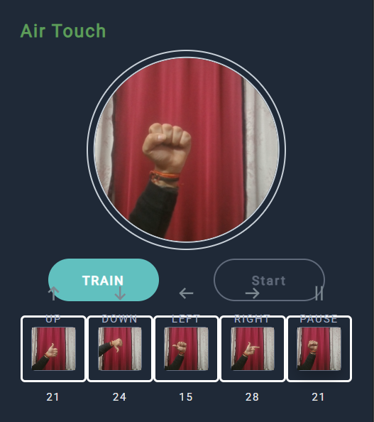

# Airtouch: Touchless Navigation

Airtouch is a **touchless navigation browser extension** that enables users to interact with web pages using hand gestures. It leverages **MobileVNet** and additional **machine learning layers** to recognize custom gestures for seamless hands-free browsing.

## Tech Stack
- **JavaScript** (Chrome Extensions API)
- **TensorFlow.js** (ML model and gesture recognition)
- **MobileVNet** (Feature extraction)
- **HTML & CSS** (UI design)
- **WebRTC** (Webcam access for gesture recognition)

## Installation & Setup

### 1. Clone the repository
```bash
git clone https://github.com/DivyanshSaharan/AirtouchExtension.git
cd airtouch-extension
```

### 2. Load the extension in Chrome
- Open **Google Chrome** and go to `chrome://extensions/`
- Enable **Developer mode** (toggle in the top right corner)
- Click **Load unpacked** and select the `airtouch-extension` folder

### 3. Activate the extension
- Click on the extension icon in the Chrome toolbar
- Grant **webcam access** when prompted

### 4. Train the model
- Open any website  
- Train the model using at least **2 gestures** (recommended: all 5)  
- Ensure you capture a **sufficient number of images per gesture** for better accuracy  

### 5. Use Gestures for Navigation
- **Up** → Scroll up  
- **Down** → Scroll down  
- **Left** → Move left  
- **Right** → Move right  
- **Pause** → Stop interaction  


## Extension UI
<p align="center">
  
</p>


